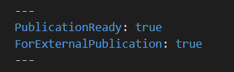

# Document Publication Guidelines

The publication process has two stages:

1. Insert flags in the content files to determine the specific Developer Portal environment where you want to publish them.
2. Upload them to the Github repository for the Developer Portal team to consume the content.

## Insert Publication Flags

Follow the instructions to insert flags in the API content:

* In a markdown file, mention the following before Heading 1:  

* If `PublicationReady` is set to **True**, the content will be published in the production environment of the Developer Portal. Otherwise, if the value is set to **False**, the content is ported to the User Acceptance Environment.  

* If `ForExternalPublication` is set to **True**, the content is ported to the external Developer Portal site. Otherwise, if the value is set to **False**, the content is published to the internal site.

## Push Content to Github Repository

The [Github Repository](https://github.com/NewDayCards/NewDay.Docs.DevPortal.Content) is structured in the following manner:  

Follow the instructions, once your API content is ready for review:

1. Create a separate branch with your API product name.
2. Upload the following files to the `apiContent` folder:

    * **Introduction.md**: The markdown file containing the API overview information.
    * **API Reference**: Contains the OpenAPI(swagger) file.

3. Raise a pull request and assign Deb Dutta Das and David Whitney as reviewers.  
4. Incorporate the comments.  
5. Merge the branch with the main branch.
6. Deb Dutta Das or David Whitney approves the content.  
  The content is imported to the Developer Portal during the next deployment.
